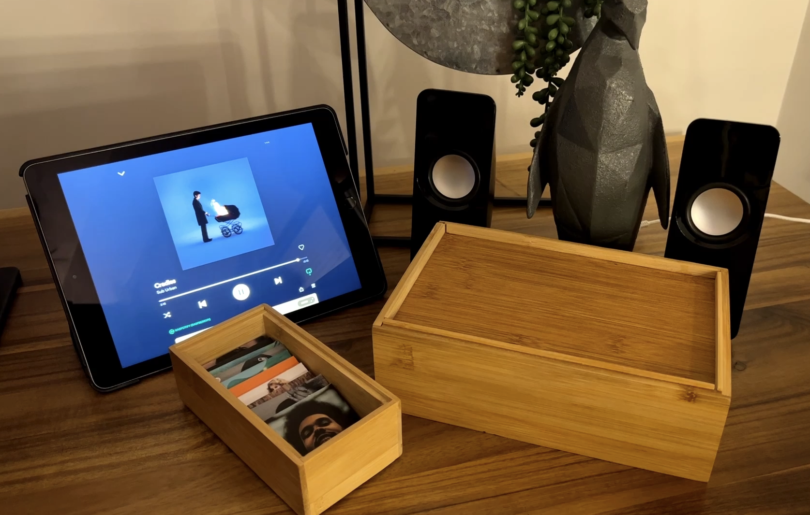

## Modern Day Record Player

This modern day record player lets you wave an album cover ontop of the wooden box, and automatically starts playing the album!!

The record player uses Radio-frequency identification (RFID), the same technology in your credit card when you tap to pay, and in access cards you scan to enter restricted buildings. This technology usually involves RFID chips such as in your credit card, and an RFID scanner such as a debit machine that can read the values of the card when it is tapped and perform an action accordingly.

In this project, the RFID scanner module is mounted inside the wooden box, and the vinyls all have an RFID sticker that can be tapped on the box to switch the album. Inside the box, the RFID scanner is wired to a Raspberry Pi, which is running a python program that switches the song based on the value it reads from the RFID scanner. Depending on the RFID sticker value, the corresponding album is played through the Spotify API.  

I wrote a very detailed blog post with all the steps you need here:
https://talaexe.com/moderndayrecordplayer

You can also watch the YouTube video here if you prefer.
https://www.youtube.com/watch?v=-jGWjFR936o

## Bill of Materials

I get a small commission if you use the links below to purchase the items for this project <3

- RFID RC522 Module with Soldered on Header Pins
    <a href="https://amzn.to/3BVej0s" target="__blank">🇺🇸 USA</a>
    <a href="https://amzn.to/3M6kun4" target="__blank">🇨🇦 Canada</a>
- RFID Stickers (13.56MHz)
    <a href="https://amzn.to/3hokkJv" target="__blank">🇺🇸 USA</a>
    <a href="https://amzn.to/3JVox3A" target="__blank">🇨🇦 Canada</a>
- Raspberry Pi 4 
    <a href="https://amzn.to/3hpanvm" target="__blank">🇺🇸 USA</a>
    <a href="https://amzn.to/35A3Efj" target="__blank">🇨🇦 Canada</a>
- Raspberry Pi 4 Power Supply
    <a href="https://amzn.to/3IsTo7v" target="__blank">🇺🇸 USA</a>
    <a href="https://amzn.to/35jZ2Ky" target="__blank">🇨🇦 Canada</a>
- Female to Female Dupont Jumper Wires
    <a href="https://amzn.to/3pnxWJw" target="__blank">🇺🇸 USA</a>
    <a href="https://amzn.to/3IuTQSq" target="__blank">🇨🇦 Canada</a>
- Speakers

## More Info
Detailed steps can be found in my blog: https://talaexe.com/moderndayrecordplayer

Blog Table of Contents
> 📌 Bill of Materials
>
> 📌 RFID Scanning
> - Wiring the RFID Scanner to the Rapsberry Pi
> - Setting up the Raspberry Pi
> - Using Python to Read RFID Sticker Values
>
> 📌 Spotify Integration
> - Making the Raspberry Pi a Spotify Connect Device
> - Spotify API Setup
> - Using Python to Control Spotify
>
> 📌 Combining the Spotify API and RFID Reader
> - Code to control Spotify API using RFID Values
> - Executing the Script on Startup of the Raspberry Pi
>
> 📌 Finishing Touches
